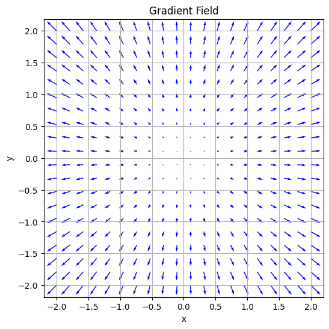
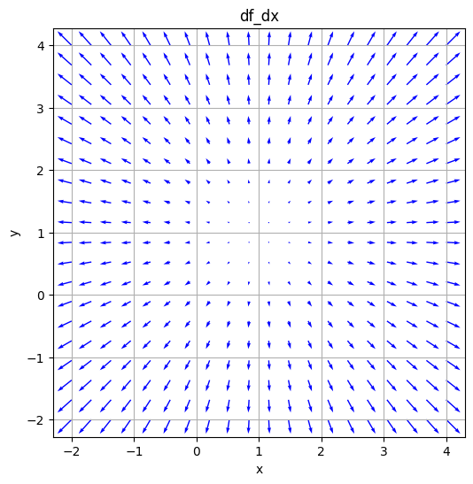
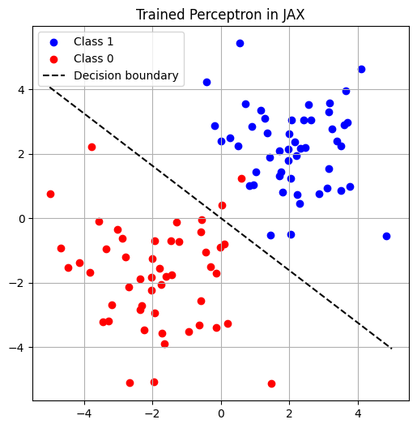
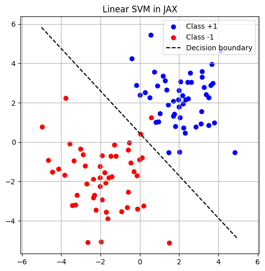

Introduction à **JAX**
- extension de numpy
- différentation automatique

https://docs.jax.dev/en/latest/index.html


```python
import jax.numpy as jnp
# comme numpy
x = jnp.array([1., 2., 3., 4., 5., 6., 7., 8.])
print(f"{x**2=}")
x = jnp.reshape(x, (8,1))
print(f"{x.T@x=}")
print(f"{x@x.T=}")
```

    x**2=Array([ 1.,  4.,  9., 16., 25., 36., 49., 64.], dtype=float32)
    x.T@x=Array([[204.]], dtype=float32)
    x@x.T=Array([[ 1.,  2.,  3.,  4.,  5.,  6.,  7.,  8.],
           [ 2.,  4.,  6.,  8., 10., 12., 14., 16.],
           [ 3.,  6.,  9., 12., 15., 18., 21., 24.],
           [ 4.,  8., 12., 16., 20., 24., 28., 32.],
           [ 5., 10., 15., 20., 25., 30., 35., 40.],
           [ 6., 12., 18., 24., 30., 36., 42., 48.],
           [ 7., 14., 21., 28., 35., 42., 49., 56.],
           [ 8., 16., 24., 32., 40., 48., 56., 64.]], dtype=float32)


Calculons un gradient. Le plus long à faire est la visualisation...


```python
import jax

def f(x): return x[0]**2 + x[1]**2
grad_f = jax.grad(f)
# c'est tout...

def plot_vector_field(nablaf, xrange=[-2,2], yrange=[-2,2], title="Gradient Field", color='blue'):
    import matplotlib.pyplot as plt
    x = jnp.linspace(xrange[0], xrange[1], 20)
    y = jnp.linspace(yrange[0], yrange[1], 20)
    X, Y = jnp.meshgrid(x, y)
    U = jnp.zeros_like(X)
    V = jnp.zeros_like(Y)
    for i in range(X.shape[0]):
        for j in range(X.shape[1]):
            grad = nablaf(jnp.array([X[i, j], Y[i, j]]))
            U = U.at[i, j].set(grad[0])
            V = V.at[i, j].set(grad[1])
    plt.figure(figsize=(6, 6))
    plt.quiver(X, Y, U, V, color=color)
    plt.title(title)
    plt.xlabel("x")
    plt.ylabel("y")
    plt.axis("equal")
    plt.grid(True)
    plt.show()

plot_vector_field(grad_f)
```


    

    


Maintenant $f$ dépend d'un paramètre $p$


```python
def f(x, p): return p[0]*(x[0]-p[0])**2 + p[1]*(x[1]-p[1])**2

p0 = jnp.array([1,1])
# dérivée (partielle) par rapport à x
df_dx = jax.grad(lambda x: f(x,p0))
# ou (attention à la différence d'utilisation)
df_dx_2 = jax.grad(f, argnums=0)
xtest = jnp.array((1.,2.))
"""
Attention
xtest = jnp.array((1,2))
va générer une erreur !!
différence avec numpy !
"""
assert jnp.allclose(df_dx(xtest), df_dx_2(xtest, p0))

plot_vector_field(df_dx, xrange=[-2,4], yrange=[-2,4], title="df_dx")
x0 = jnp.array([1,1])
# dérivée (partielle) par rapport à p
df_dp = jax.grad(lambda p: f(x0,p))
# ou
df_dp_2 = jax.grad(f, argnums=1)
ptest = jnp.array((1.,2.))
assert jnp.allclose(df_dp(ptest), df_dp_2(x0, ptest))

plot_vector_field(df_dp, xrange=[-2,4], yrange=[-2,4], title="df_dp", color='yellow')

```


    

    


    

    


Voici un perceptron (à la main)


```python
import jax
import jax.numpy as jnp
import matplotlib.pyplot as plt

def create_data(svm=False):
    # Données synthétiques pour la classification binaire
    key = jax.random.PRNGKey(0)
    X_pos = 1.3*jax.random.normal(key, (50, 2)) + jnp.array([2.0, 2.0])
    X_neg = 1.6*jax.random.normal(key, (50, 2)) + jnp.array([-2.0, -2.0])
    X = jnp.concatenate([X_pos, X_neg])
    if svm:
        Y = jnp.concatenate([jnp.ones(50), -jnp.ones(50)])  # SVM utilise labels ±1
    else:
        Y = jnp.concatenate([jnp.ones(50), jnp.zeros(50)])
    return key, X, Y, X_pos, X_neg

# Fonction d'activation
def sigmoid(x):
    return 1 / (1 + jnp.exp(-x))

# Perceptron : y = sigmoid(w · x + b)
def predict(params, x):
    w, b = params
    return sigmoid(jnp.dot(w, x) + b)

# Fonction perte : 'binary cross-entropy loss'
def loss_fn(params, x, y):
    y_pred = predict(params, x)
    return -y * jnp.log(y_pred + 1e-8) - (1 - y) * jnp.log(1 - y_pred + 1e-8)

# La version vectorisée (par jax.vmap) et accelérée (par lé décorateur jax.jit)
@jax.jit
def total_loss(params, X, Y):
    # vectorized version!
    loss_vec = jax.vmap(lambda x, y: loss_fn(params, x, y))
    return jnp.mean(loss_vec(X, Y))

# Une itération méthode du gradient
@jax.jit
def update(params, X, Y, lr=0.01):
    grads = jax.grad(total_loss)(params, X, Y)
    return [(w - lr * dw) for w, dw in zip(params, grads)]

# Creation des données
key, X, Y, X_pos, X_neg = create_data()

# Initialisation
params = [jax.random.normal(key, (2,)), 0.0]

# Boucle d'entrainement
for epoch in range(100):
    params = update(params, X, Y)
    if epoch % 10 == 0:
        l = total_loss(params, X, Y)
        print(f"Epoch {epoch}, Loss: {l:.4f}")

# Plot
w, b = params
plt.figure(figsize=(6, 6))
plt.scatter(X_pos[:, 0], X_pos[:, 1], color='blue', label='Class 1')
plt.scatter(X_neg[:, 0], X_neg[:, 1], color='red', label='Class 0')

# Frontière de décision : w1*x + w2*y + b = 0  => y = -(w1*x + b)/w2
x_line = jnp.linspace(-5, 5, 100)
y_line = -(w[0] * x_line + b) / w[1]
plt.plot(x_line, y_line, 'k--', label='Decision boundary')
plt.legend()
plt.grid(True)
plt.title("Trained Perceptron in JAX")
plt.show()
```

    Epoch 0, Loss: 0.0655
    Epoch 10, Loss: 0.0654
    Epoch 20, Loss: 0.0654
    Epoch 30, Loss: 0.0653
    Epoch 40, Loss: 0.0652
    Epoch 50, Loss: 0.0651
    Epoch 60, Loss: 0.0650
    Epoch 70, Loss: 0.0649
    Epoch 80, Loss: 0.0648
    Epoch 90, Loss: 0.0647


    

    


La même chose avec une SVM ('support vector machine').


```python
import jax
import jax.numpy as jnp
import matplotlib.pyplot as plt

# SVM prediction: w · x + b
def predict(params, x):
    w, b = params
    return jnp.dot(w, x) + b

# Hinge loss for one sample
def hinge_loss(params, x, y):
    return jnp.maximum(0.0, 1.0 - y * predict(params, x))

# La version vectorisée et accelérée
@jax.jit
def total_loss(params, X, Y, C=1.0):
    hinge_losses = jax.vmap(hinge_loss, in_axes=(None, 0, 0))(params, X, Y)
    w = params[0]
    return 0.05 * jnp.dot(w, w) + C * jnp.mean(hinge_losses)

# Une itération méthode du gradient
@jax.jit
def update(params, X, Y, lr=0.1, C=1.0):
    grads = jax.grad(total_loss)(params, X, Y, C)
    return [(w - lr * dw) for w, dw in zip(params, grads)]

# Creation des données
key, X, Y, X_pos, X_neg = create_data(svm=True)

# Initialisation
params = [jax.random.normal(key, (2,)), 0.0]  # (w, b)

# Boucle d'entrainement
for epoch in range(100):
    params = update(params, X, Y, lr=0.1, C=1.0)
    if epoch % 10 == 0:
        l = total_loss(params, X, Y)
        print(f"Epoch {epoch}, Loss: {l:.4f}")

# Plot
w, b = params
plt.figure(figsize=(6, 6))
plt.scatter(X_pos[:, 0], X_pos[:, 1], color='blue', label='Class +1')
plt.scatter(X_neg[:, 0], X_neg[:, 1], color='red', label='Class -1')

# Frontière de décision : w1*x + w2*y + b = 0  => y = -(w1*x + b)/w2
x_line = jnp.linspace(-5, 5, 100)
y_line = -(w[0] * x_line + b) / w[1]
plt.plot(x_line, y_line, 'k--', label='Decision boundary')

plt.legend()
plt.grid(True)
plt.title("Linear SVM in JAX")
plt.axis("equal")
plt.show()
```

    Epoch 0, Loss: 0.3934
    Epoch 10, Loss: 0.3261
    Epoch 20, Loss: 0.2708
    Epoch 30, Loss: 0.2274
    Epoch 40, Loss: 0.1920
    Epoch 50, Loss: 0.1643
    Epoch 60, Loss: 0.1415
    Epoch 70, Loss: 0.1228
    Epoch 80, Loss: 0.1088
    Epoch 90, Loss: 0.0988


    

    


```python

```
